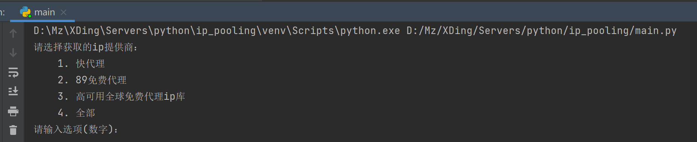

# ip_poolding

#### 介绍
Python3.9 Spider爬虫IP代理池的建池程序，通过IP代理池的建池程序，可以学习到基本的爬虫方法和思路（仅供参考）

#### 软件架构
Python 3.9
selenium 4.1.3
chromedriver 100.0.4896.60 (需要适配本电脑chrome版本) [下载链接](https://registry.npmmirror.com/binary.html?path=chromedriver/)

#### 安装运行教
1.  git clone git@gitee.com:mz100/ip_poolding.git
2.  进入目录，执行：pip install -r requirements.txt
3.  当前文件执行 python main.py
    

#### 项目说明
学习Python爬虫，必不可少就是建立自己的IP代理池，项目就是为了建立自己IP代理池进行设计，爬取免费代理IP提供商的网站，建造自己的IP代理池，目前爬取的网站有：[快代理](https://www.kuaidaili.com/free/)，[89免费代理](https://www.89ip.cn/)，[高可用全球免费代理ip库](https://ip.jiangxianli.com/)（当然，如果需要稳定性还是购买他们的收费产品）
通过建造自己的IP代理池，可以让我们学习到基础的爬虫知识：requests、selement、pands、sqlite等。

#### 抓取切勿干非法之事，开源仅供参考

    

